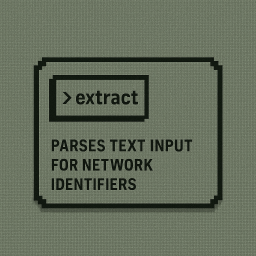

# Extract



Welcome to the documentation for **extract**, a command-line utility that parses
text for network identifiers such as IP addresses, CIDR ranges and MAC addresses.

## Features

- IPv4 and IPv6 extraction
- CIDR block recognition
- MAC address matching
- IP range parsing
- Streaming operation for large files

## Installation

See the [project README](../README.md) for platform-specific binaries or build
from source:

```bash
cargo build --release
```

## Getting Started

Run `extract` with some input text to see immediate results:

```bash
echo 'Access from 192.168.1.1 to 10.0.0.0/8' | extract
```

Output:

```text
192.168.1.1
10.0.0.0/8
```

The following chapters provide more examples and advanced usage tips.
